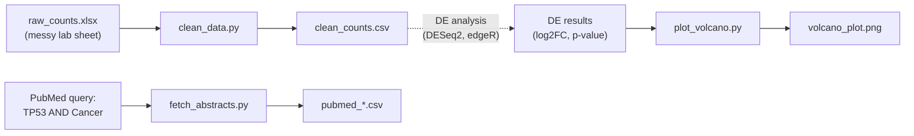
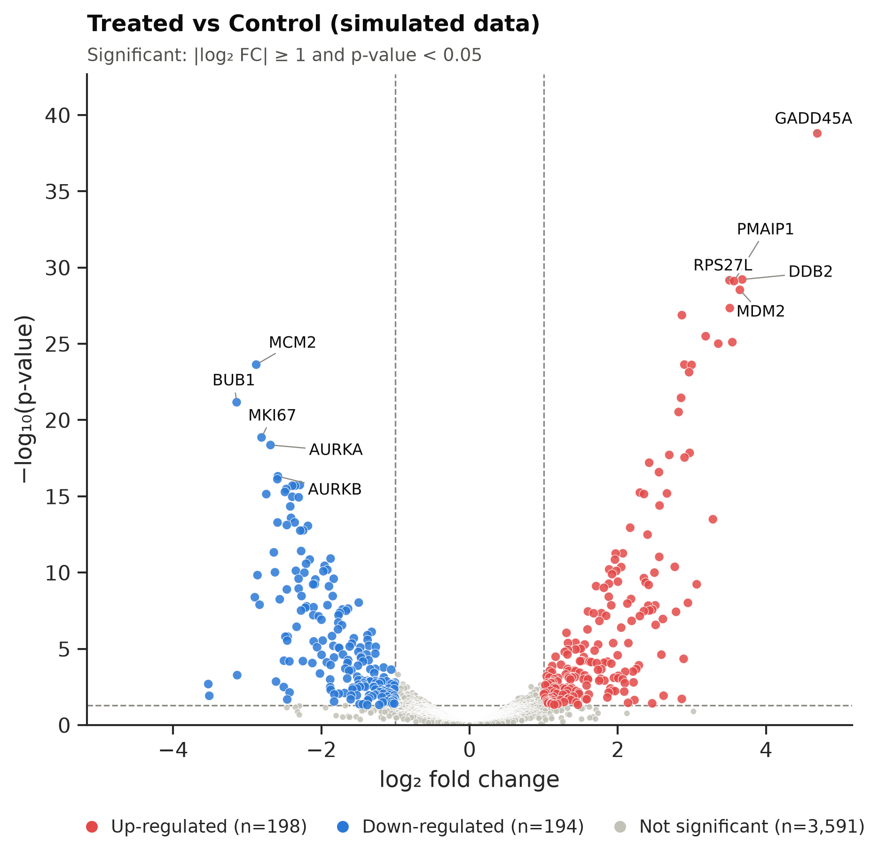

# 🧬 Bioinformatics Toolkit

[](https://www.python.org/)
[](https://github.com/psf/black)
[](LICENSE)
[](https://github.com/HarisVl92/Bioinformatics-Toolkit/actions/workflows/ci.yml)

**Command-line tools that automate three everyday research-data tasks: cleaning messy
expression spreadsheets, mining PubMed, and producing publication-ready figures.**

Each tool is a single, self-contained Python script with a documented CLI, input
validation, clear error messages and an auditable log. You can drop it into a lab
workflow, a shell script or an HPC job without changing any code.

---

## Table of Contents

- [Overview](#overview)
- [Value for Researchers](#value-for-researchers)
- [Repository Structure](#repository-structure)
- [Installation](#installation)
- [How to Use (CLI Examples)](#how-to-use-cli-examples)
- [Demo / Visuals](#demo--visuals)
- [Testing & Code Quality](#testing--code-quality)
- [Tech Stack](#tech-stack)
- [Data & Ethics Notes](#data--ethics-notes)
- [Roadmap](#roadmap)
- [Author](#author)
- [License](#license)

## Overview

| Module | Tool | Input → Output | Highlights |
| --- | --- | --- | --- |
| **A · Data Wrangling** | [`clean_data.py`](1_data_wrangling/clean_data.py) | Messy Excel/CSV count table → tidy integer count matrix | Fixes casing, whitespace, duplicates, text placeholders and missing values, then prints an audit summary |
| **B · Literature Mining** | [`fetch_abstracts.py`](2_ncbi_fetcher/fetch_abstracts.py) | PubMed query → CSV of articles | PMID, title, abstract, authors, journal, year, DOI and link; respects NCBI rate limits |
| **C · Visualization** | [`plot_volcano.py`](3_data_visualization/plot_volcano.py) | Differential-expression results → volcano plot | 300-dpi PNG/PDF/SVG, colour-blind-safe palette, non-overlapping gene labels |



## Value for Researchers

- **Hours of manual spreadsheet work become seconds.** The tools fix the problems that
  break downstream analysis (duplicated genes, `NA` text in numeric columns, mixed-case
  symbols) consistently, every time.
- **Reproducible by design.** Fixed random seeds, pinned dependency versions and
  deterministic outputs mean you get the same result when you rerun the analysis a year
  later.
- **Transparent and auditable.** Every cleaning step reports what it removed, merged or
  imputed, ready for a methods section or a lab notebook.
- **Safe defaults.** Raw input is never overwritten. Missing counts are dropped rather
  than invented unless you ask for imputation. Every judgement call is an explicit flag.
- **No coding required to use them.** Everything is controlled with documented flags
  (`--help`), so wet-lab colleagues can run the tools too.
- **Ready for automation.** Exit codes are consistent (`0` success, `1` data or network
  error, `2` invalid arguments), so the tools chain cleanly in shell scripts,
  Snakemake/Nextflow pipelines, cron jobs and HPC schedulers.
- **Publication-quality output.** Figures are 300 dpi, PDF/SVG exports embed fonts that
  journals accept and stay editable in Illustrator, and the palette has been tested for
  colour blindness.
- **Works with real-world formats.** The tools read `.xlsx`, `.csv` and `.tsv`, match
  column names case-insensitively, and accept DESeq2, edgeR and limma exports directly.

## Repository Structure

```text
Bioinformatics-Toolkit/
├── 1_data_wrangling/
│   ├── generate_mock_rnaseq.py      # builds a realistic, messy Excel count sheet
│   ├── clean_data.py                # CLI: clean and standardise the count table
│   ├── data/raw_counts.xlsx         # demo input (generated)
│   └── output/clean_counts.csv      # demo output
├── 2_ncbi_fetcher/
│   ├── fetch_abstracts.py           # CLI: PubMed search → CSV (Bio.Entrez)
│   └── output/pubmed_tp53_and_cancer.csv
├── 3_data_visualization/
│   ├── generate_mock_de_results.py  # builds DESeq2-style demo results
│   ├── plot_volcano.py              # CLI: publication-ready volcano plot
│   ├── data/mock_de_results.csv
│   └── output/volcano_plot.png
├── tests/                           # pytest suite (offline, ~1 s)
├── docs/images/                     # screenshots for this README
├── .github/workflows/ci.yml         # GitHub Actions: black --check + pytest
├── run_demo.sh                      # regenerate every demo output with one command
├── requirements.txt                 # pinned runtime dependencies
├── requirements-dev.txt             # + black and pytest
└── pyproject.toml                   # black and pytest configuration
```

## Installation

Requires **Python 3.12+** (tested on 3.13).

```bash
git clone https://github.com/HarisVl92/Bioinformatics-Toolkit.git
cd Bioinformatics-Toolkit
python3 -m venv .venv
source .venv/bin/activate          # Windows: .venv\Scripts\activate
pip install -r requirements.txt    # use requirements-dev.txt to also run tests and black
```

## How to Use (CLI Examples)

Every tool prints its full documentation with `--help`. Run the commands from inside each
module folder; the paths in the examples are relative to it.

> **Tip:** regenerate every demo output at once with
> `NCBI_EMAIL=you@university.edu bash run_demo.sh`

### Module A · Clean a messy count table

```bash
cd 1_data_wrangling
python generate_mock_rnaseq.py      # creates data/raw_counts.xlsx (seed 42)
python clean_data.py --input data/raw_counts.xlsx --output output/clean_counts.csv
```

Real output:

```text
16:20:01 | WARNING  | Set 2 non-numeric cell(s) to missing: '-', 'n.d.'
16:20:01 | INFO     | Merging duplicate gene symbols (sum): BTG2, CCNG1, FAS
16:20:01 | INFO     | Cleaning summary:
16:20:01 | INFO     |   Input rows ..................................   128
16:20:01 | INFO     |   Empty rows removed ..........................     2
16:20:01 | INFO     |   Rows without a gene symbol removed ..........     2
16:20:01 | INFO     |   Non-numeric/negative cells set to missing ...     2
16:20:01 | INFO     |   Exact duplicate rows removed ................    10
16:20:01 | INFO     |   Rows with missing counts removed ............    13
16:20:01 | INFO     |   Duplicate symbols merged (sum) ..............     3
16:20:01 | INFO     |   Genes in output .............................    98
16:20:01 | INFO     | Saved 98 genes x 6 samples to output/clean_counts.csv
```

What the cleaner fixes:

| Problem in the raw sheet | Example | How it is handled |
| --- | --- | --- |
| Inconsistent symbol case or whitespace | `tp53`, `␣Brca1␣` | Stripped and upper-cased (HGNC convention for human genes) |
| Header typos | `Treated_2␣` | Whitespace stripped |
| Empty rows, rows without a gene symbol | — | Removed |
| Text or negative numbers in count cells | `NA`, `n/a`, `-`, `n.d.`, `-4` | Converted to missing values |
| Exact duplicate rows | the same block pasted twice | Removed (compared after normalisation) |
| Missing counts | blank cells | `--na-strategy`: `drop` (default), `zero` or `median` |
| A gene reported more than once | two features for `BTG2` | `--duplicate-strategy`: `sum` (default), `mean` or `first` |
| Non-numeric annotation columns | `Description` | Ignored, with a warning |
| Decimals in a raw count matrix | `12.5` | Rounded, with a warning (is it TPM?) |

| Option | Default | Description |
| --- | --- | --- |
| `-i`, `--input` | *required* | Raw table: `.xlsx`, `.xlsm`, `.csv` or `.tsv` |
| `-o`, `--output` | *required* | Clean matrix: `.csv`, or `.tsv` for tab-separated |
| `--gene-col` | `Gene_Symbol` | Gene-symbol column (case-insensitive) |
| `--sheet` | `0` | Excel sheet name or zero-based index |
| `--na-strategy` | `drop` | `drop` never invents data; `zero` suits merged tables where blank means "not detected" |
| `--duplicate-strategy` | `sum` | `sum` is the standard way to collapse several features of one gene in raw counts |
| `-v`, `--verbose` | off | Show debug messages |

### Module B · Fetch PubMed abstracts

```bash
cd 2_ncbi_fetcher
python fetch_abstracts.py --query "TP53 AND Cancer" --retmax 15 --email you@university.edu
```

Real output:

```text
16:20:02 | INFO     | PubMed: 34,717 records match 'TP53 AND Cancer'; downloading 15
16:20:02 | INFO     | Downloading records 1-15 of 15
16:20:03 | INFO     | Saved 15 records (15 with an abstract) to output/pubmed_tp53_and_cancer.csv
16:20:03 | INFO     |   [2025] TP53 mutations in cancer: Molecular features and therapeutic opportunities (R... (PMID 39450536)
16:20:03 | INFO     |   [2018] Mutational processes shape the landscape of TP53 mutations in human cancer. (PMID 30224644)
16:20:03 | INFO     |   [2023] The Role of TP53 in Adaptation and Evolution. (PMID 36766853)
```

More examples:

```bash
# Full PubMed syntax: field tags, date ranges and Boolean logic, newest first
python fetch_abstracts.py -q "BRCA1[tiab] AND 2020:2025[dp]" -n 200 -e you@uni.edu --sort pub_date

# An NCBI API key raises the rate limit from 3 to 10 requests per second
export NCBI_API_KEY=your_key_here
python fetch_abstracts.py -q "CRISPR AND zebrafish" -n 500 -e you@uni.edu -o output/crispr.csv
```

| CSV column | Content |
| --- | --- |
| `pmid` | PubMed identifier |
| `title` | Article title (inline HTML such as `<i>` removed) |
| `abstract` | Full abstract; structured sections keep their labels (`BACKGROUND: …`) |
| `authors` | `Lastname Initials; …` (consortia by name) |
| `journal`, `year` | Journal title and publication year |
| `doi`, `pubmed_url` | DOI and a direct link to the PubMed page |

| Option | Default | Description |
| --- | --- | --- |
| `-q`, `--query` | *required* | Any PubMed search string |
| `-e`, `--email` | *required* | Your e-mail address (NCBI usage policy) |
| `-n`, `--retmax` | `20` | Maximum records to download (up to 10,000) |
| `--api-key` | `$NCBI_API_KEY` | Optional NCBI API key |
| `--sort` | `relevance` | `relevance` (PubMed Best Match) or `pub_date` |
| `-o`, `--output` | `output/pubmed_<query>.csv` | Destination CSV |

### Module C · Volcano plot

```bash
cd 3_data_visualization
python generate_mock_de_results.py  # creates data/mock_de_results.csv (seed 42)
python plot_volcano.py --input data/mock_de_results.csv --output output/volcano_plot.png \
    --title "Treated vs Control (simulated data)"
```

It works directly on real DESeq2 output exported from R:

```r
write.csv(as.data.frame(res), "deseq2_results.csv")   # in R
```

```bash
python plot_volcano.py -i deseq2_results.csv -o volcano.pdf --pval-col padj --top-n 20
```

The tool recognises the unnamed first column that `write.csv` creates as the gene column.
DESeq2's `log2FoldChange` matches the default `--fc-col` because column names are
case-insensitive. p-values of exactly 0 (numerical underflow) are drawn at the top of the
plot instead of producing infinity. For **edgeR** use `--fc-col logFC --pval-col FDR`, and
for **limma** use `--fc-col logFC --pval-col adj.P.Val`.

| Option | Default | Description |
| --- | --- | --- |
| `-i`, `--input` | *required* | CSV/TSV with one row per gene |
| `-o`, `--output` | `volcano_plot.png` | `.png`, `.pdf`, `.svg` or `.tif` |
| `--fc-col` / `--pval-col` | `Log2FoldChange` / `pvalue` | Columns to plot; use `padj` for FDR-based calls |
| `--gene-col` | auto-detect | Column used for the gene labels |
| `--fc-threshold` | `1.0` | Minimum \|log2 fold change\| (1.0 = two-fold) |
| `--pval-threshold` | `0.05` | Significance cut-off |
| `--top-n` | `10` | Genes to label, split between up and down (`0` = none) |
| `--title`, `--dpi`, `--figsize` | `Volcano plot`, `300`, `7 6` | Title, resolution and size in inches |

## Demo / Visuals

<!--
📸 HOW TO ADD YOUR SCREENSHOTS (this comment is only visible in the source)

1. Terminal output
   - Activate the environment and run, from the repository root:
         NCBI_EMAIL=you@university.edu bash run_demo.sh
   - Take a screenshot of the terminal (Ubuntu: Shift+PrtSc, select the area;
     macOS: Cmd+Shift+4; Windows: Win+Shift+S). Crop it to the output and aim for
     roughly 1200-1600 px wide.
   - Save it as docs/images/terminal_demo.png
   - Under "Terminal run" below, remove the HTML comment markers around the image
     line so that it reads: 
2. Optional: a screenshot of `python plot_volcano.py --help` saved as
   docs/images/cli_help.png, embedded the same way.
3. Volcano plot
   - The figure below is embedded straight from 3_data_visualization/output/volcano_plot.png
     and refreshes every time you rerun the tool, so no screenshot is needed.
   - To show a plot from your own data instead, save it as
     docs/images/volcano_custom.png and change the image path below.
-->

### Volcano plot



*Simulated p53-activation experiment: classic p53 targets (GADD45A, MDM2, PMAIP1, DDB2)
go up and cell-cycle genes (MKI67, AURKA, BUB1, MCM2) go down. Rendered by
`plot_volcano.py` at 300 dpi.*

### Terminal run

<!--  -->

<details>
<summary>Full output of <code>bash run_demo.sh</code></summary>

```text
==> [1/3] Data wrangling: messy Excel sheet -> clean count matrix
16:20:01 | INFO     | Simulated 108 genes x 6 samples (3 control vs 3 treated, seed=42)
16:20:01 | INFO     |   injected: Gene symbols repeated with different counts    5
16:20:01 | INFO     |   injected: Re-formatted copies of existing rows           3
16:20:01 | INFO     |   injected: Mixed-case or space-padded gene symbols       38
16:20:01 | INFO     |   injected: Blank count cells                             10
16:20:01 | INFO     |   injected: Text placeholders in count cells               4
16:20:01 | INFO     |   injected: Rows without a gene symbol                     2
16:20:01 | INFO     |   injected: Completely empty rows                          2
16:20:01 | INFO     |   injected: Exact duplicate rows                           8
16:20:01 | INFO     |   injected: Column headers with trailing whitespace        1
16:20:01 | INFO     | Wrote 128 messy rows to data/raw_counts.xlsx
16:20:01 | INFO     | Loaded 128 rows x 7 columns from data/raw_counts.xlsx
16:20:01 | INFO     | Sample columns (6): Control_1, Control_2, Control_3, Treated_1, Treated_2, Treated_3
16:20:01 | WARNING  | Set 2 non-numeric cell(s) to missing: '-', 'n.d.'
16:20:01 | INFO     | Merging duplicate gene symbols (sum): BTG2, CCNG1, FAS
16:20:01 | INFO     | Cleaning summary:
16:20:01 | INFO     |   Input rows ..................................   128
16:20:01 | INFO     |   Empty rows removed ..........................     2
16:20:01 | INFO     |   Rows without a gene symbol removed ..........     2
16:20:01 | INFO     |   Non-numeric/negative cells set to missing ...     2
16:20:01 | INFO     |   Exact duplicate rows removed ................    10
16:20:01 | INFO     |   Rows with missing counts removed ............    13
16:20:01 | INFO     |   Duplicate symbols merged (sum) ..............     3
16:20:01 | INFO     |   Genes in output .............................    98
16:20:01 | INFO     | Saved 98 genes x 6 samples to output/clean_counts.csv

==> [2/3] PubMed fetcher: "TP53 AND Cancer" -> CSV of abstracts
16:20:02 | INFO     | PubMed: 34,717 records match 'TP53 AND Cancer'; downloading 15
16:20:02 | INFO     | Downloading records 1-15 of 15
16:20:03 | INFO     | Saved 15 records (15 with an abstract) to output/pubmed_tp53_and_cancer.csv
16:20:03 | INFO     |   [2025] TP53 mutations in cancer: Molecular features and therapeutic opportunities (R... (PMID 39450536)
16:20:03 | INFO     |   [2018] Mutational processes shape the landscape of TP53 mutations in human cancer. (PMID 30224644)
16:20:03 | INFO     |   [2023] The Role of TP53 in Adaptation and Evolution. (PMID 36766853)

==> [3/3] Visualization: differential-expression results -> volcano plot
16:20:03 | INFO     | Simulated 4000 genes (seed=42): 24 p53 targets up, 18 cell-cycle genes down
16:20:03 | INFO     | 302 genes with padj < 0.05; 17 without p-value, 336 without padj (as in DESeq2)
16:20:03 | INFO     | Wrote mock DESeq2 results to data/mock_de_results.csv
16:20:04 | INFO     | Loaded 4000 genes from data/mock_de_results.csv (fold change: 'Log2FoldChange', p-value: 'pvalue', labels: 'gene')
16:20:04 | WARNING  | Skipping 17 gene(s) without a fold change or p-value (e.g. DESeq2 outliers or filtered genes)
16:20:04 | INFO     | Up-regulated: 198 | Down-regulated: 194 | Not significant: 3591
16:20:04 | INFO     | Saved volcano plot (300 dpi) to output/volcano_plot.png

==> Done: results are in 1_data_wrangling/output, 2_ncbi_fetcher/output and 3_data_visualization/output
```

</details>

## Testing & Code Quality

```bash
pip install -r requirements-dev.txt
pytest            # 29 offline tests in about a second; NCBI calls are mocked
black --check .   # formatting
```

GitHub Actions runs both on every push and pull request, on Python 3.12 and 3.13.

## Tech Stack

| Area | Tools |
| --- | --- |
| Language | Python 3.12+ |
| Data wrangling | pandas, NumPy, openpyxl |
| Literature mining | Biopython (`Bio.Entrez`, NCBI E-utilities) |
| Visualization | matplotlib, seaborn, adjustText |
| CLI and logging | argparse, logging (standard library) |
| Quality | pytest, black, GitHub Actions |

## Data & Ethics Notes

- **Simulated data.** The scripts in this repository generate `raw_counts.xlsx` and
  `mock_de_results.csv` with fixed seeds to demonstrate the tools. The gene names are
  real, but the expression values and effects are simulated, not results of an experiment.
- **NCBI usage policy.** Use your real e-mail address, because NCBI uses it to contact
  you before blocking excessive traffic. The rate limit (3 requests/s, or 10 with an API
  key) is enforced automatically. Run large downloads on weekends or between 9 pm and
  5 am US Eastern time. Placeholder addresses such as `dummy@example.com` are for
  illustration only.
- **Copyright.** PubMed abstracts may be protected by the publishers' copyright. The
  sample CSV (15 records) is included only to show the output format; check the terms
  before redistributing larger collections.

## Roadmap

- [ ] Add a differential-expression step in Python (PyDESeq2) that links Module A's
      output to Module C.
- [ ] Detect gene symbols that Excel silently converted into dates (e.g. `SEPT2` →
      `2-Sep`).
- [ ] Add MeSH terms and keywords to the PubMed export.
- [ ] Package the tools as a Snakemake workflow and a Docker image.
- [ ] Interactive HTML volcano plot with hover tooltips.

## Author

**Charalampos Vlassakis** · Bioinformatics MSc student building tools for reproducible
research-data workflows.

[GitHub](https://github.com/HarisVl92)
<!-- Add more profile links on the line above, for example:
· [LinkedIn](https://www.linkedin.com/in/your-profile) · [Upwork](https://www.upwork.com/freelancers/your-profile)
-->

*Open to remote **Bioinformatics & Research Data Assistant** projects: data cleaning,
literature mining and figure preparation.*

## License

Released under the [MIT License](LICENSE).
